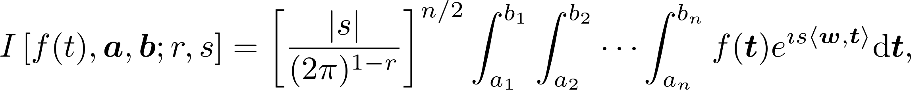
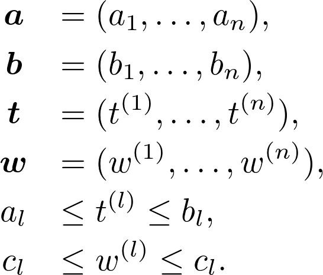

This is a package in `R` to numerically calculate Fourier-type integrals of multivariate functions with compact support evaluated at regular grids. Specifically, integrals of the type

<!--
$$
I \left[f(t), \boldsymbol{a}, \boldsymbol{b};r, s \right]
  = \left[ \frac{|s|}{(2\pi)^{1 - r}}\right]^{n/2}
  \int_{a_1}^{b_1}\int_{a_2}^{b_2}\cdots\int_{a_n}^{b_n}
  f(\boldsymbol{t})e^{\imath s 
  \langle \boldsymbol{w}, \boldsymbol{t}\rangle} \text{d}\boldsymbol{t},
$$
-->


where,

<!--
$\boldsymbol{a} = (a_1, \ldots, a_n)$, 
$\boldsymbol{b} = (b_1, \ldots, b_n)$, 
$\boldsymbol{t} = (t^{(1)}, \ldots, t^{(n)})$, 
$\boldsymbol{w} = (w^{(1)}, \ldots, w^{(n)})$, 
$a_l \leq t^{(l)} \leq b_l$,
$c_l \leq w^{(l)} \leq c_l$.
-->


Common values for _r_ are -1, 0 and -1, while common values for _s_ are _-2\pi_, -1, 1 and _2\pi_. For example, if _f_ is a density function, _s = 1_ and _r = 1_ could be used to obtain the characteristic function of _f_. Conversely, if _f_ is the characteristic function of a probability density function, then _r = -1_ and _s = -1_ could be used to recover the density.

The implementation of this algorithm is the one described in [Inverarity (2002), Fast Computation of multidimensional Integrals](http://epubs.siam.org/doi/abs/10.1137/S106482750138647X).

Some examples (also found in documentation).

#### Example 1: Recovering standard normal from its characteristic function

```{r}
library(fourierin)

                                        # Compute integral
out <- fourierin(f = function(t) exp(-t^2/2),
                 a = -5, b = 5, c = -3, d = 3,
                 r = -1, s = -1, resol = 64)
grid <- out$w                           # Extract grid and values
values <- Re(out$values)

plot(grid, values, type = "l", col = 3, xlab = "x", ylab = "f(x)")
lines(grid, dnorm(grid), col = 4)
legend("topleft", legend = c("True", "Recovered"), col = c(4, 3),
      lwd = 1)
```

#### Example 2: Computing characteristic function of a gamma density

```{r}

library(fourierin)
                                        # Compute integral
shape <- 5
rate <- 3
out <- fourierin(f = function(t) dgamma(t, shape, rate),
                 a = -15, b = 15, c = 0, d = 8,
                 r = 1, s = 1, resol = 64)
grid <- out$w                           # Extract grid
re_values <- Re(out$values)             # Real values
im_values <- Im(out$values)             # Imag values

                                        # Now compute the real and
                                        # imaginary true values of the
                                        # characteric function.
true_cf <- function(t, shape, rate) (1 - 1i*t/rate)^-shape
true_re <- Re(true_cf(grid, shape, rate))
true_im <- Im(true_cf(grid, shape, rate))

                                        # Compare them. We can see a
                                        # slight discrepancy on the
                                        # tails, but that is fixed
                                        # when resulution is
                                        # increased.
plot(grid, re_values, type = "l", col = 3, xlab = "t",
     ylab = expression(paste("Re ", phi(t))))
lines(grid, true_re, col = 4)
legend("topright", legend = c("True", "Recovered"), col = c(4, 3),
      lwd = 1)

                                        # Same here
plot(grid, im_values, type = "l", col = 3, xlab = "t",
     ylab = expression(paste("Im ", phi(t))))
lines(grid, true_im, col = 4)
legend("topright", legend = c("True", "Recovered"), col = c(4, 3),
      lwd = 1)
```

